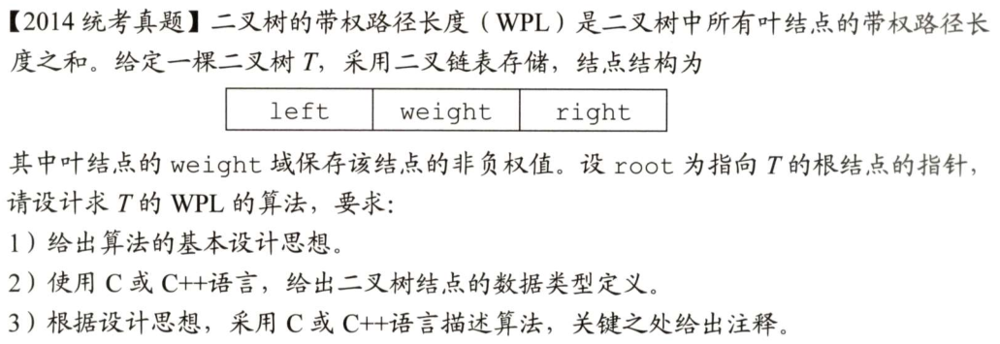
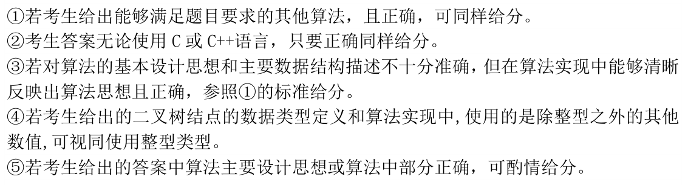
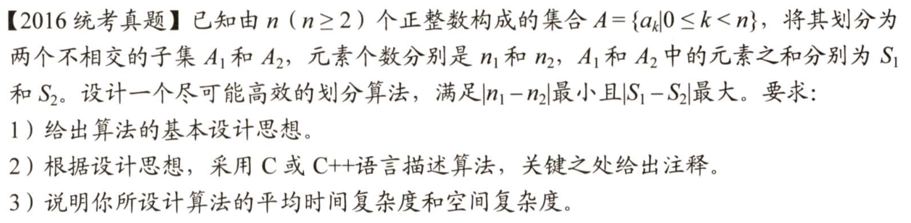
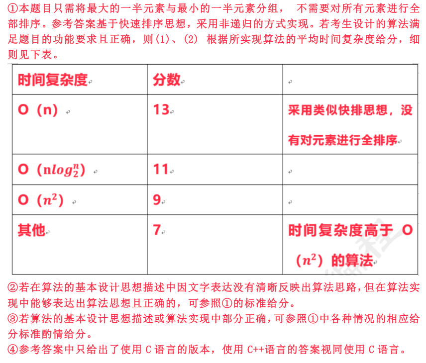
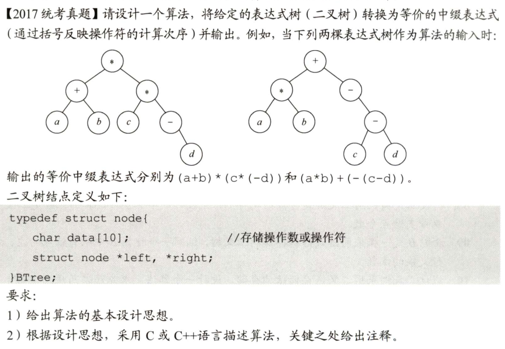
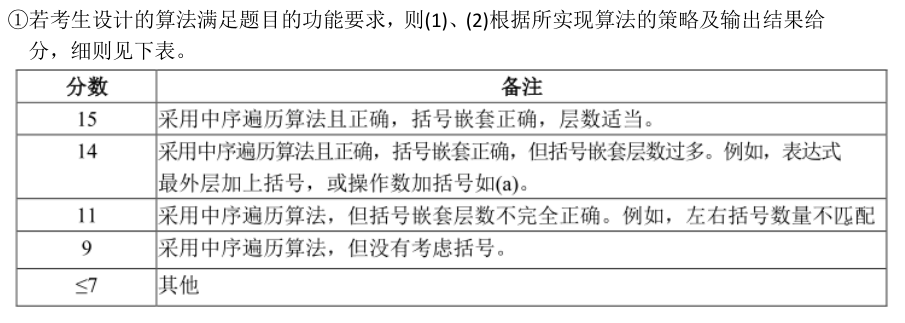
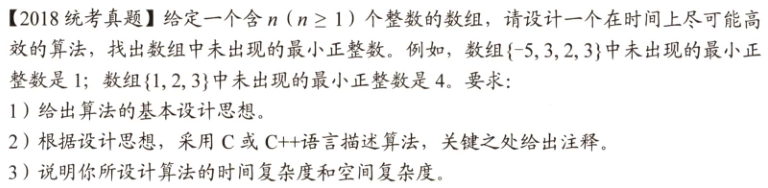
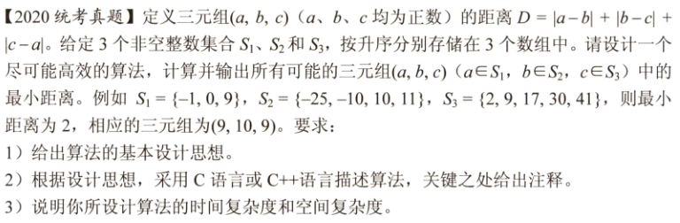
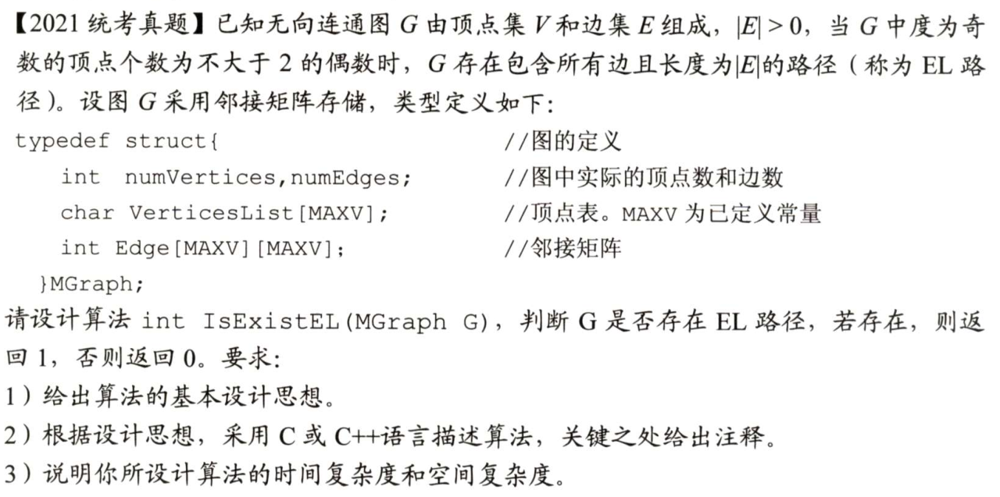

<br>
<p align="center">

</p>

<p align="center">
日拱一卒 功不唐捐
</p>

## 特性

- 🍓 09~22年真题
- 🍒 暴力解 + 最优解
- 🥭 仿照王道书上的写法，含注释
- 🍉 [GoogleTest](https://github.com/google/googletest) 全面测试
- 🍇 真题题目 + 评分标准

## 使用

推荐使用 CLion 打开本项目，可在 `test_ds.cpp` 文件中添加更多测试：

```c++
TEST(xx, xx) {
    
    ...
    
    EXPECT_EQ(add(1, 2), 3);
    EXPECT_TRUE(is_exist());
}
```

## 目录


|                  | 重点                   | 难度 |
| :--------------- | :--------------------- | :--- |
| [2009](./09.cpp) | 单链表，双指针         | ⭐⭐   |
| [2010](./10.cpp) | 数组                   | ⭐    |
| [2011](./11.cpp) | 数组                   | ⭐    |
| [2012](./12.cpp) | 单链表                 | ⭐    |
| [2014](./14.cpp) | 二叉树，带权路径长度   | ⭐⭐   |
| [2015](./15.cpp) | 单链表                 | ⭐    |
| [2016](./16.cpp) | 快排，划分             | ⭐⭐⭐  |
| [2017](./17.cpp) | 二叉树，中缀表达式     | ⭐⭐   |
| [2018](./18.cpp) | 数组                   | ⭐    |
| [2019](./19.cpp) | 单链表，双指针         | ⭐⭐⭐  |
| [2020](./20.cpp) | 数组                   | ⭐⭐   |
| [2021](./21.cpp) | 图，邻接矩阵           | ⭐    |
| 2022             | 等官方真题出来后再更新 |      |
  


## 真题题目 & 评分标准

<details>
<summary><b>2009</b></summary>


</details>


<details>
<summary><b>2010</b></summary>


参考答案时间复杂度为O(n)，空间复杂度O(1)，无具体评判标准
</details>


<details>
<summary><b>2011</b></summary>


参考答案时间复杂度为O(n)，空间复杂度O(1)，无具体评判标准
</details>


<details>
<summary><b>2012</b></summary>


</details>


<details>
<summary><b>2013</b></summary>


</details>


<details>
<summary><b>2014</b></summary>



</details>


<details>
<summary><b>2015</b></summary>


</details>


<details>
<summary><b>2016</b></summary>



</details>


<details>
<summary><b>2017</b></summary>



</details>


<details>
<summary><b>2018</b></summary>


参考答案时间复杂度为O(n)，无具体评判标准
</details>


<details>
<summary><b>2019</b></summary>


参考答案时间复杂度为O(n)，无具体评判标准
</details>


<details>
<summary><b>2020</b></summary>


参考答案时间复杂度为O(n)，空间复杂度O(1)，无具体评判标准
</details>


<details>
<summary><b>2021</b></summary>


参考答案时间复杂度为O(n^2)，空间复杂度O(1)，无具体评判标准
</details>
