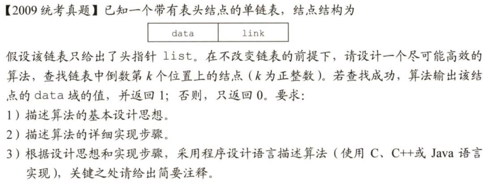
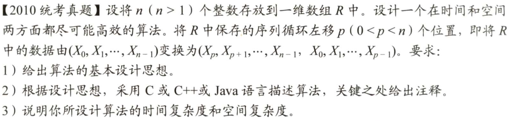
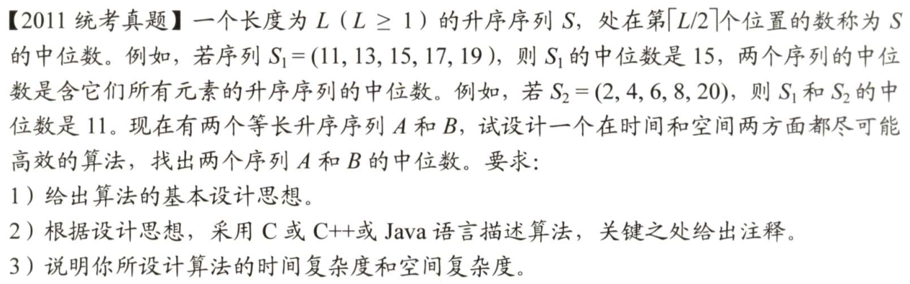

# 408数据结构历年代码真题详解

- 09~22年真题
- 暴力解 + 最优解
- 仿照王道书上的写法
- [GoogleTest](https://github.com/google/googletest) 全面测试
- 缓慢更新中 ...

> 欢迎下载后自己运行，也可仿照实例在 `test_ds.cpp` 下增加更多测试（本人运行环境为 Win11 + CLion）

## 09真题

- 暴力解：首先扫描一次求出链表长度len，然后重新向后扫描len-k个结点即可

- 最优解：双指针，其中一指针先走k步，然后同步走到终点，后一指针所在位置即倒数第k个结点

> 评分说明：
> - 若所给出的算法采用一遍扫描方式就能得到正确结果，可给满分15分
> - 若采用两遍或多遍扫描才能得到正确结果，最高分为10分
> - 若采用递归算法得到正确结果，最高给10分
> - 若实现算法的空间复杂度过高（使用了大小与k有关的辅助数组），但结果正确，最高给10分

## 10真题

## 11真题描述

