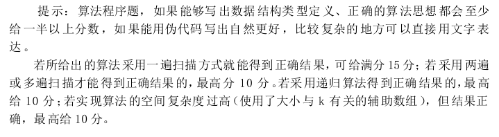
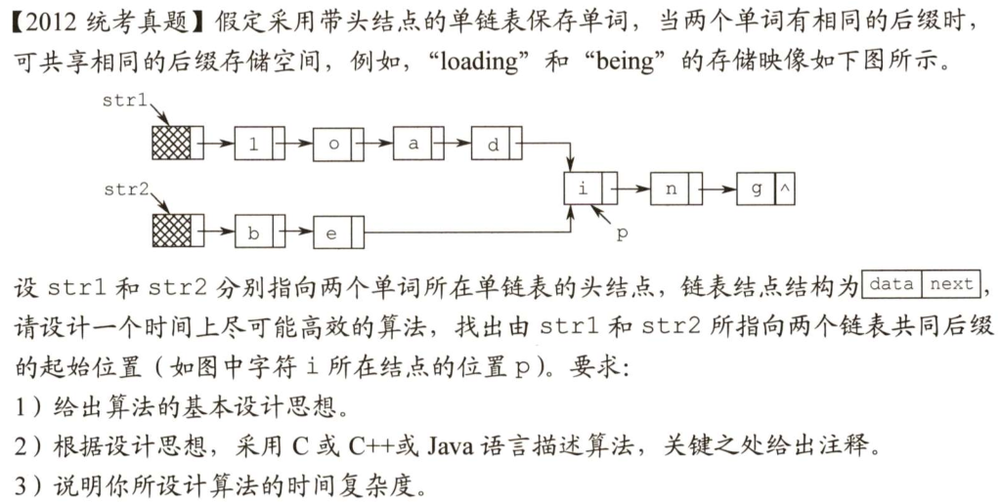
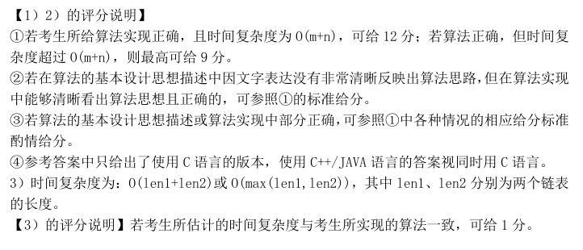
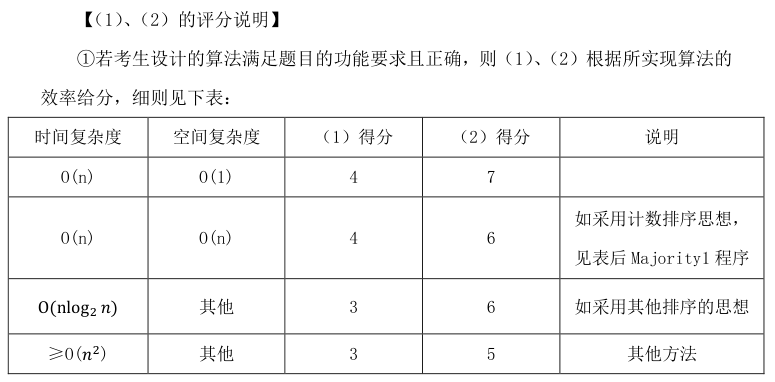
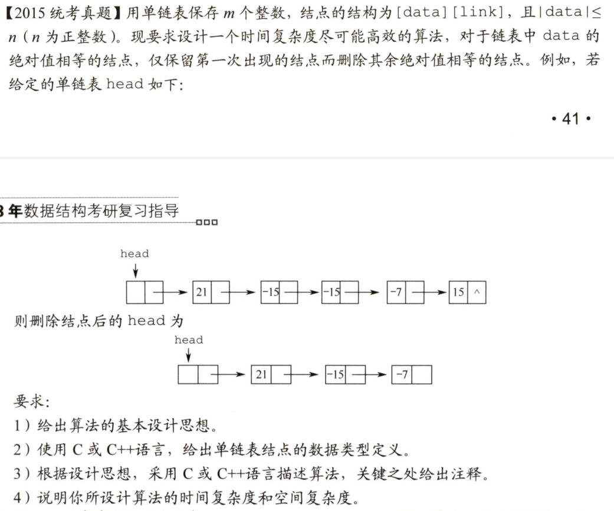
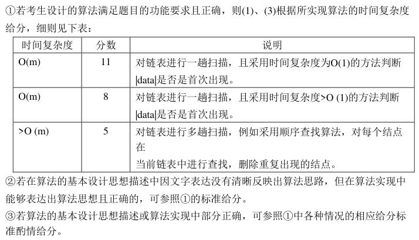
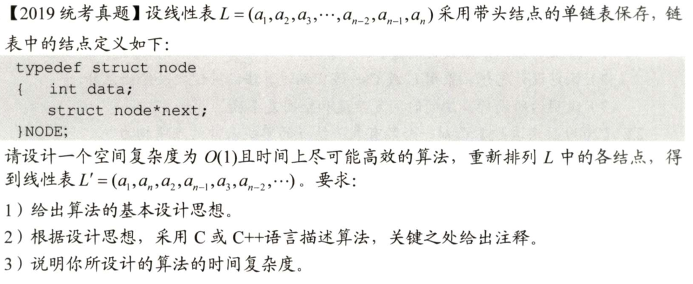

# 408数据结构历年代码真题详解

- 09~22年真题
- 暴力解 + 最优解
- 仿照王道书上的写法，含注释
- [GoogleTest](https://github.com/google/googletest) 全面测试
- 真题题目 + 评分标准
- 缓慢更新中 ...

> 欢迎 clone 后自己运行，也可仿照实例在 `test_ds.cpp` 下增加更多测试

## 目录

- [09真题](#09)：单链表，双指针 ⭐⭐
- [10真题](#10)：数组 ⭐
- [11真题](#11)：数组 ⭐⭐
- [12真题](#12)：单链表 ⭐
- [13真题](#13)
- [14真题](#14)
- [15真题](#15)：单链表 ⭐
- [16真题](#16)
- [17真题](#17)
- [18真题](#18)
- [19真题](#19)：单链表，双指针 ⭐⭐⭐

---

## 09

### 评分标准

### [点击查看本题代码🐟](./09.cpp)

---

## 10

### 评分标准

参考答案时间复杂度为O(n)，空间复杂度O(1)，无具体评判标准

### [点击查看本题代码🐟](./10.cpp)

---

## 11

### 评分标准

参考答案时间复杂度为O(n)，空间复杂度O(1)，无具体评判标准

### [点击查看本题代码🐟](./11.cpp)

---

## 12

### 评分标准

### [点击查看本题代码🐟](./12.cpp)

---

## 13

### 评分标准

### [点击查看本题代码🐟](./13.cpp)

---

## 14

---

## 15

### 评分标准

### [点击查看本题代码🐟](./15.cpp)

---

## 16

---

## 17

---

## 18

---

## 19

### 评分标准

参考答案时间复杂度为O(n)，无具体评判标准

### [点击查看本题代码🐟](./19.cpp)

---

## 20

---